# Fund-Chain
Fundchain is a revolutionary decentralized application (DApp) that facilitates seamless fundraising for projects and humanitarian initiatives. Leveraging the power of blockchain technology, the platform establishes a transparent, secure, and efficient ecosystem for both donors and project initiators. Whether it's a charitable cause, a social project, or an innovative idea, Fundchain empowers individuals to drive positive change in the world

## TechStack
* TailwindCSS
* React
* ThirdWeb
* Web3
* Solidity
* Metamask
* Etherscan
* Sepolia
* NodeJS

## When you enter the Fund-Chain
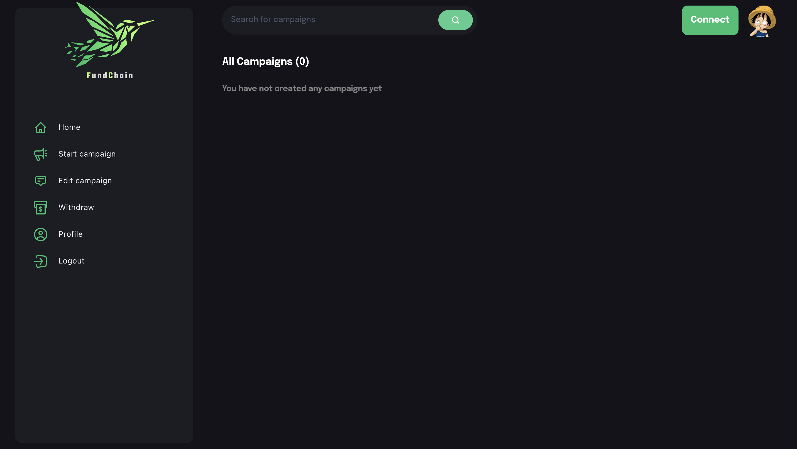

## Made Connection
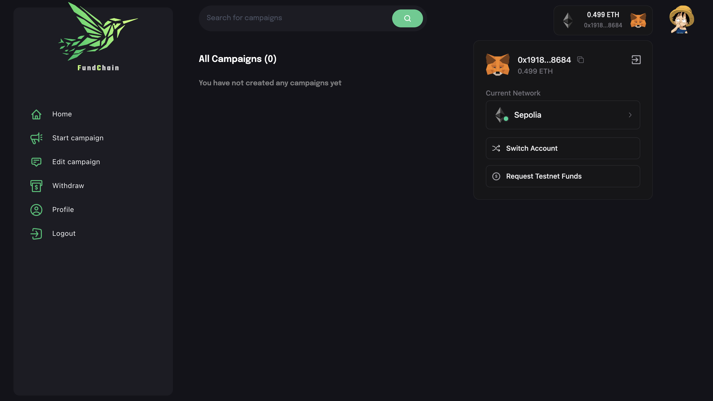

## Click on Start campaign 

## Create campaign
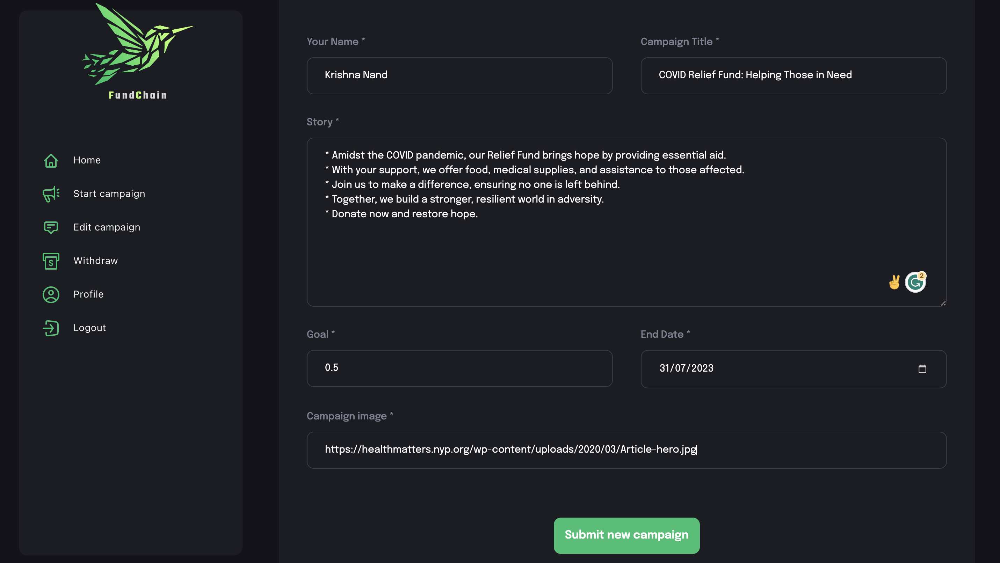

## Confirm the transaction
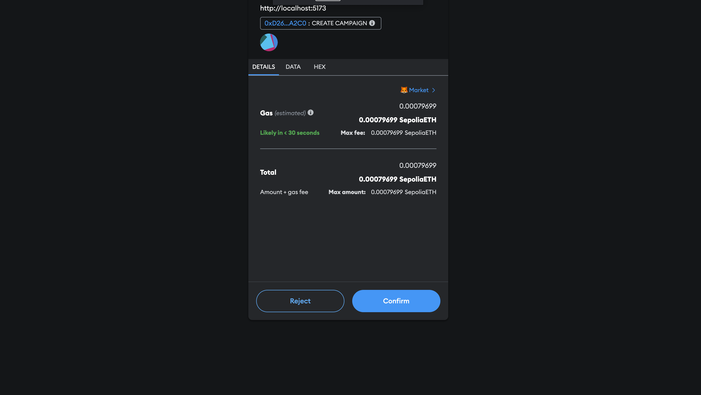

## Loading Transaction 
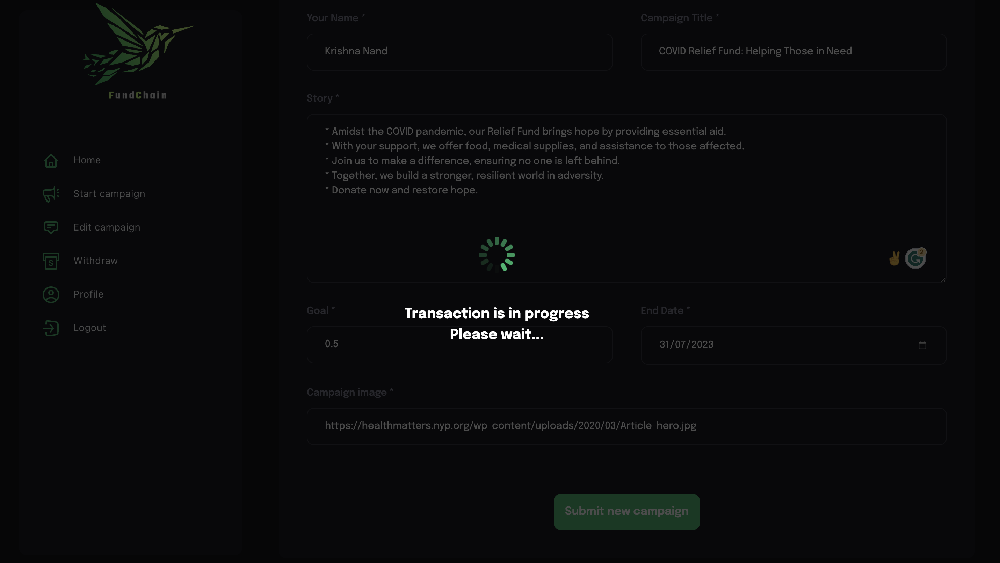

## Campaign has been Created
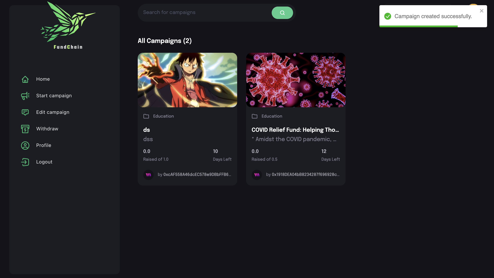

## See the transaction history on Etherscan
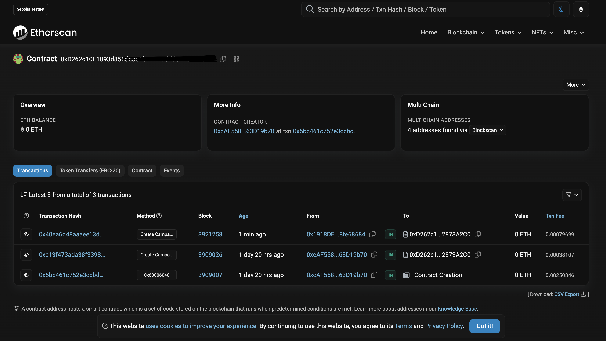

## Campaign Details
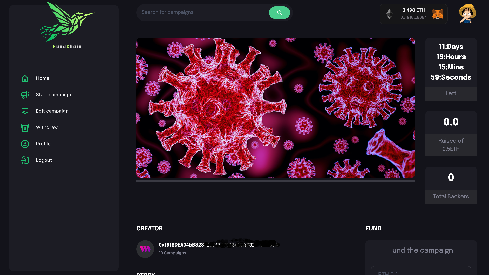

## Add funds
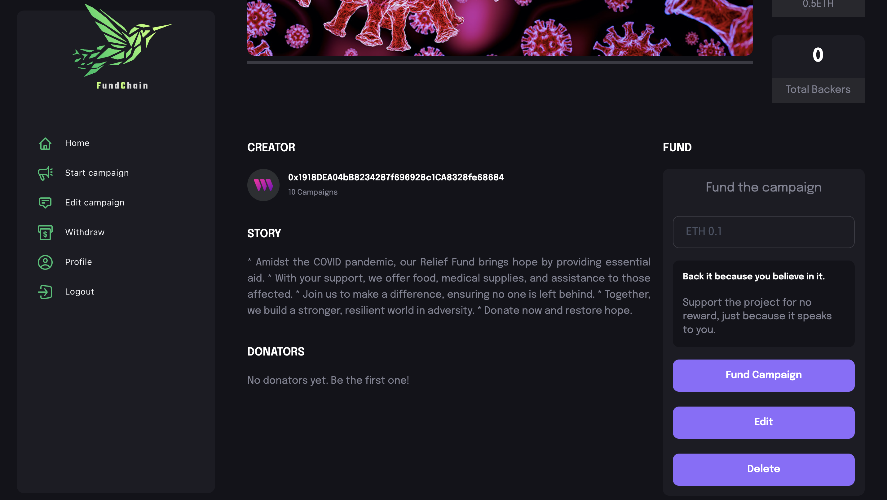

## Fund send successfully 
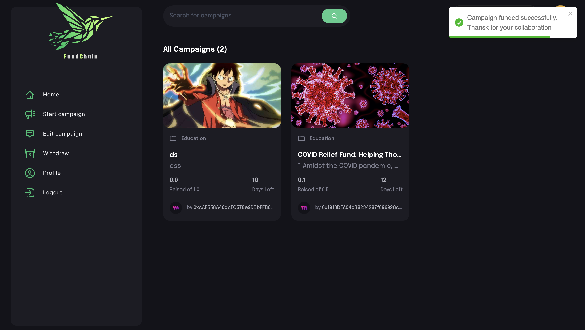

## All Campaign
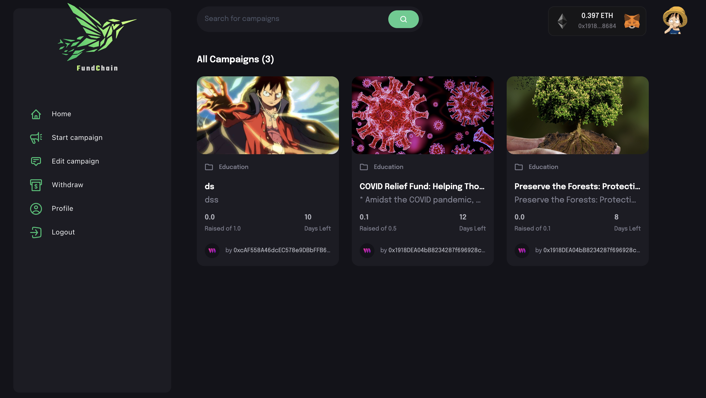
